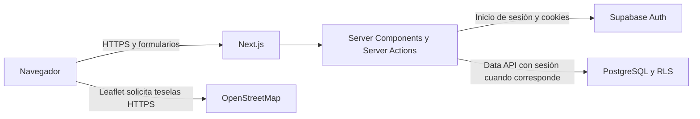
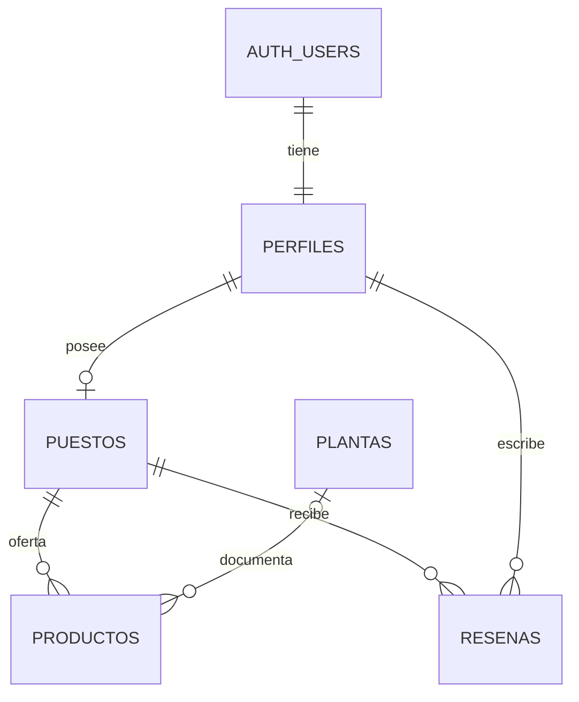

# Diagramas

## Arquitectura lógica

```mermaid
flowchart LR
    B[Navegador] -->|HTTPS y formularios| N[Next.js]
    N --> S[Server Components y Server Actions]
    S -->|Inicio de sesión y cookies| A[Supabase Auth]
    S -->|Data API con sesión cuando corresponde| P[PostgreSQL y RLS]
    B -->|Leaflet solicita teselas HTTPS| M[OpenStreetMap]
```

## Modelo relacional

```mermaid
erDiagram
    AUTH_USERS ||--|| PERFILES : tiene
    PERFILES ||--o| PUESTOS : posee
    PUESTOS ||--o{ PRODUCTOS : oferta
    PLANTAS o|--o{ PRODUCTOS : documenta
    PUESTOS ||--o{ RESENAS : recibe
    PERFILES ||--o{ RESENAS : escribe
```
